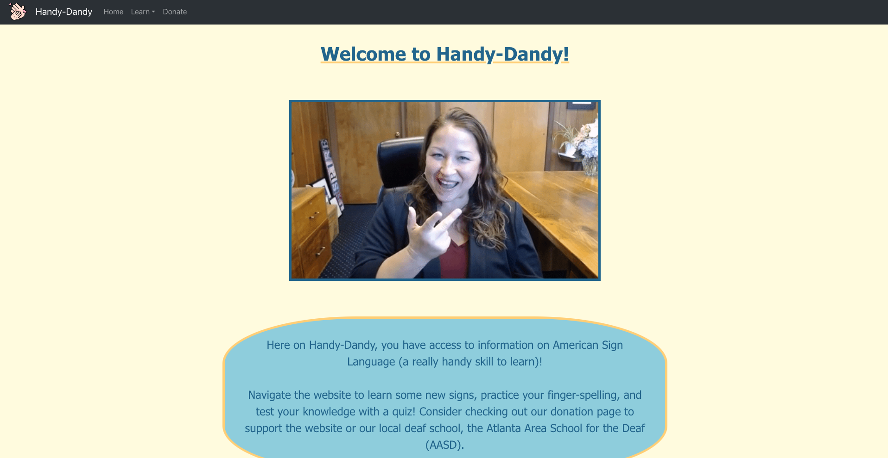
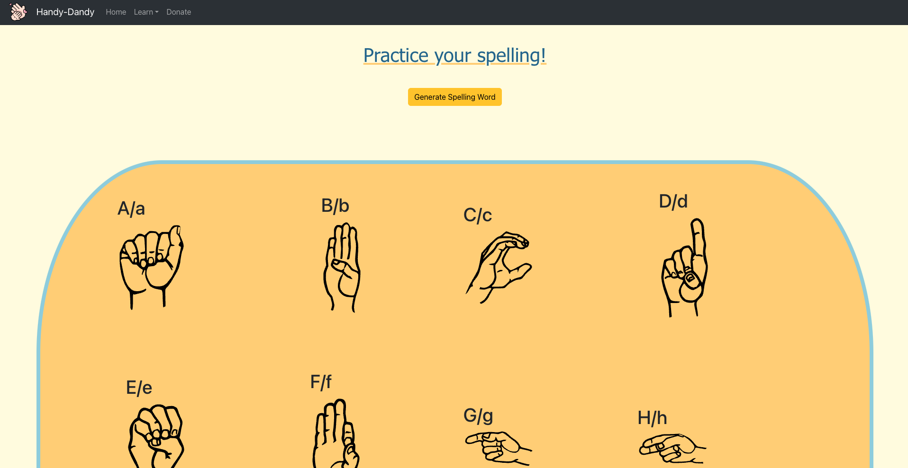
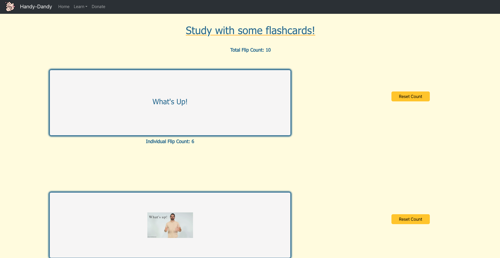
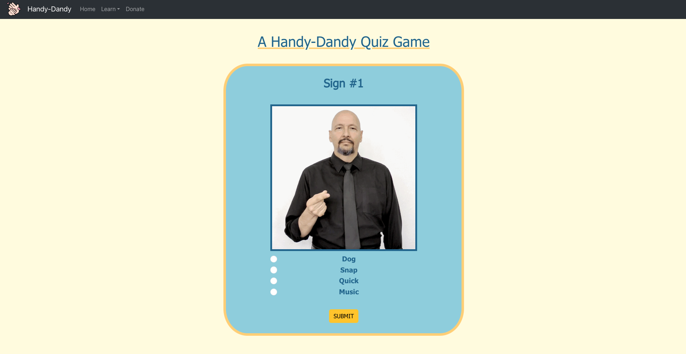
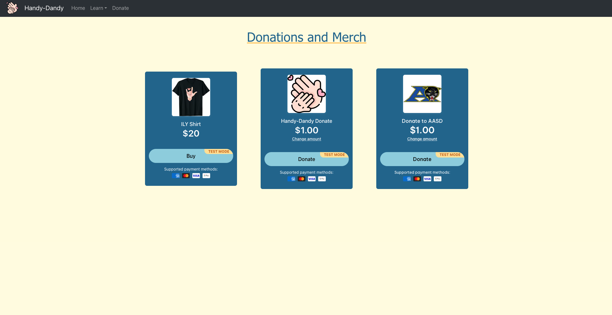

# Handy-Dandy

This is a website dedicated to learning about American Sign Language. I have a passion for ASL and spreading awareness about Deaf culture and education. Therefore, I decided to center my solo project on sign language.

On Handy-Dandy, users can practice their finger-spelling randomly generated words by following a chart with each letter sign. Users can also practice learning words and phrases with flashcards. Lastly, users can test their knowledge with a short quiz game. There is also a "Donate" page that accepts (test) payments for donations to the website, donations to the Atlanta Area School for the Deaf, and a custom "I Love You" sign shirt.

Home Page:

Spelling Page:

Practice Page:

Quiz Page:

Donate Page:

Developer:
Justin Adams
 
